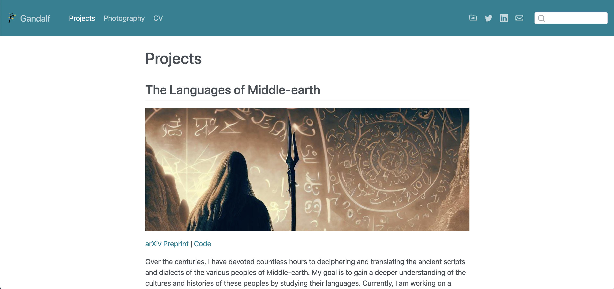
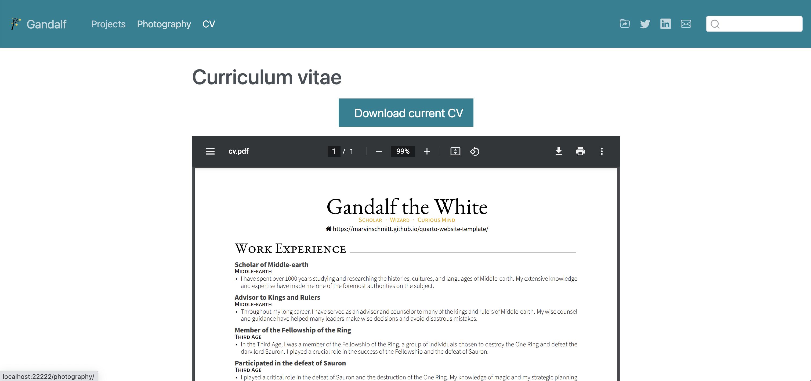

# Quarto Template for the Tutorial

This repository contains the template for the website tutorial at <https://www.marvinschmitt.com/blog/website-tutorial-quarto/>.

https://www.marvinschmitt.com/blog/website-tutorial-quarto/
Create Your Website with Quarto: Complete Tutorial and Template
This tutorial and template will help you build your own personal website with Quarto. It is a full guide with step-by-step instructions for your personal or academic homepage.

https://medium.com/p/50ec15b059dd

https://quarto.org/docs/publishing/github-pages.html#source-branch

  
&nbsp; &nbsp; &nbsp; &nbsp;
  
  
  
&nbsp; &nbsp; &nbsp; &nbsp;
  

